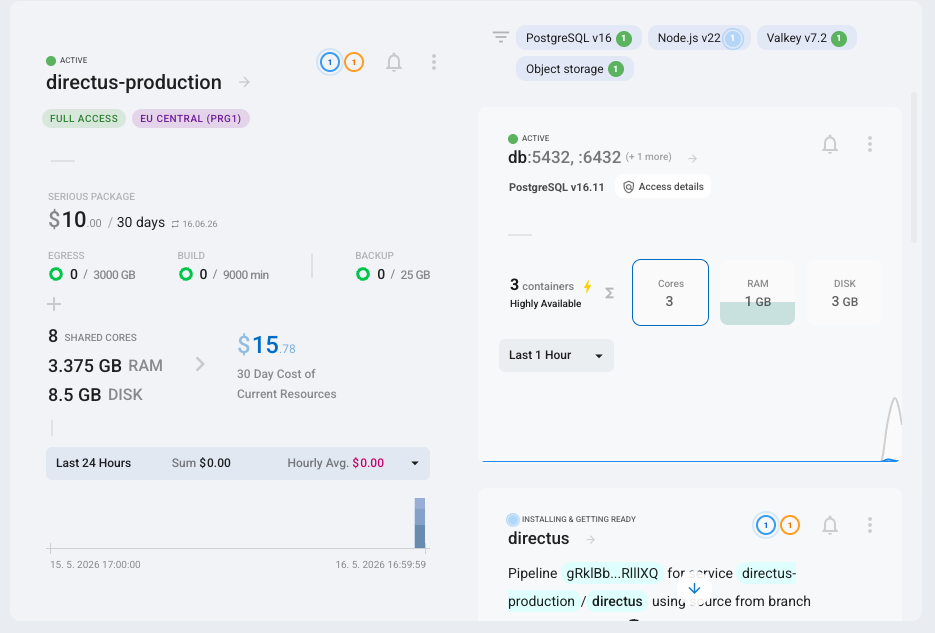
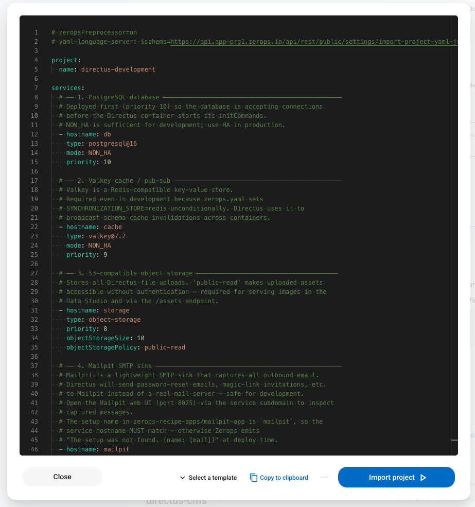
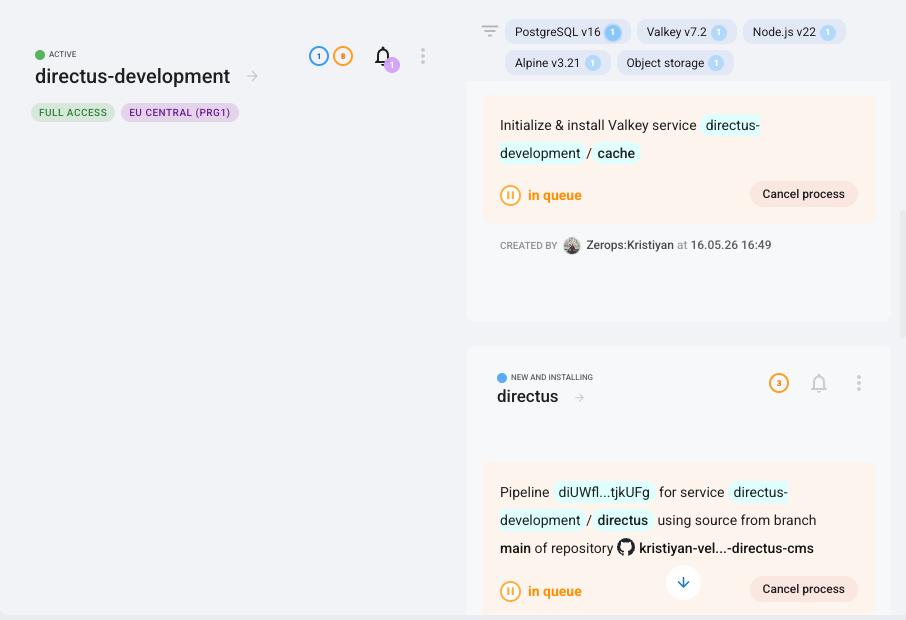
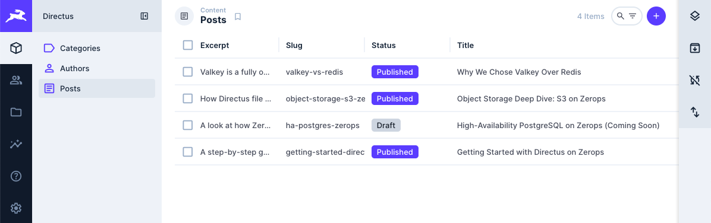
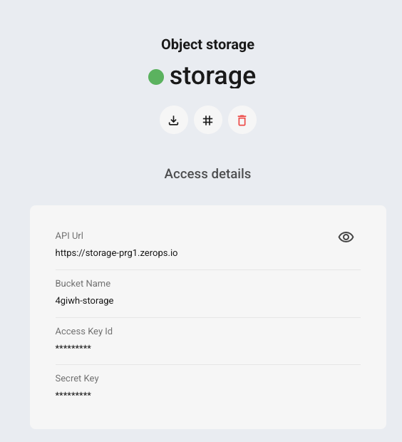

# Implementing Directus on Zerops — Step-by-Step Guide

This guide walks through every decision and implementation detail behind this Zerops recipe for [Directus](https://directus.io). It is written for developers who want to understand how the "silver platter" experience is assembled — from a blank Zerops project to a fully running, seeded, production-ready CMS in a single import.

---

## Table of Contents

1. [What you get out of the box](#1-what-you-get-out-of-the-box)
2. [Prerequisites](#2-prerequisites)
3. [Quick deploy (one-click)](#3-quick-deploy-one-click)
4. [Architecture overview](#4-architecture-overview)
5. [Project structure explained](#5-project-structure-explained)
6. [zerops.yaml — the build and runtime pipeline](#6-zeropsyaml--the-build-and-runtime-pipeline)
7. [import.yaml — declaring your services](#7-importyaml--declaring-your-services)
8. [Schema management with snapshot.yaml](#8-schema-management-with-snapshotyaml)
9. [Auto-healing seed hook](#9-auto-healing-seed-hook)
10. [Object storage (S3)](#10-object-storage-s3)
11. [Valkey cache and multi-container sync](#11-valkey-cache-and-multi-container-sync)
12. [Email — Mailpit (development) and SMTP (production)](#12-email--mailpit-development-and-smtp-production)
13. [Environment variables and secrets](#13-environment-variables-and-secrets)
14. [Local development with Docker Compose](#14-local-development-with-docker-compose)
15. [First login and post-deploy checklist](#15-first-login-and-post-deploy-checklist)
16. [Upgrading Directus](#16-upgrading-directus)
17. [Extending the schema](#17-extending-the-schema)
18. [Scaling](#18-scaling)
19. [Key decisions and trade-offs](#19-key-decisions-and-trade-offs)

---

## 1. What you get out of the box

After a single Zerops import, you have:

| What | Details |
|---|---|
| Directus 11 running on Alpine Node.js 22 (LTS) | Production HTTP server on port 8055 |
| PostgreSQL 16 | Primary datastore (NON_HA in development, 3-node HA cluster in production) |
| Valkey 7.2 (Redis-compatible) | Cache + pub/sub sync for multi-container deployments |
| S3-compatible object storage | File uploads, image transformations |
| Mailpit (development only) | SMTP capture — no real email ever leaves the development environment |
| Demo schema | `categories`, `authors`, `posts` collections with full relations |
| Seeded demo content | 3 categories · 2 authors · 4 posts (3 published, 1 draft) · 8 files with metadata |
| Admin user | `admin@example.com` with avatar, title, location, description, and tags |
| API token | Randomly generated `ADMIN_TOKEN` for CI/CD and automation |
| Insights dashboard | "Content Overview" with 5 metric panels pre-built in Directus Insights |

<!-- IMAGE PLACEHOLDER
  Description: Zerops project dashboard screenshot showing all 5 services (directus, db, cache, storage, mailpit) in the running state with green status indicators.
  Suggested filename: 01-zerops-project-dashboard.png
-->


---

## 2. Prerequisites

- A [Zerops account](https://app.zerops.io) (free tier is sufficient for the Development environment)
- Git (to fork and customize the recipe)
- Docker + Docker Compose (for local development only)

No local Node.js installation is required — the build runs inside Zerops.

---

## 3. Quick deploy (one-click)

Click the badge in the [README](./README.md) or navigate to:

```
https://app.zerops.io/recipe/directus
```

Select **Development** or **Production**, confirm the import, and Zerops will:

1. Provision all services in parallel (db, cache, storage, mailpit, directus)
2. Build Directus from this repository (`npm ci --omit=dev`)
3. Run `directus bootstrap` → `node scripts/ensure-schema.mjs` (applies schema only on a fresh DB) before starting the server
4. Start Directus; the seed hook fires automatically on `server.start`

The whole process takes approximately **2–3 minutes** on a cold start.

<!-- IMAGE PLACEHOLDER
  Description: Zerops recipe import screen showing the Directus recipe with Development/Production environment selector and the "Deploy" button highlighted.
  Suggested filename: 02-recipe-import-screen.png
-->


<!-- IMAGE PLACEHOLDER
  Description: Zerops pipeline progress view showing the three stages: "Build", "Deploy", "Run" all completed with green checkmarks and timing information.
  Suggested filename: 03-pipeline-progress.png
-->


---

## 4. Architecture overview

```
Browser / API clients
        ↓  HTTPS (Zerops edge)
┌─────────────────────────────────┐
│  Directus 11  (Alpine Node.js 22)│
│  port 8055                      │
│                                 │
│  ┌──────────────────────────┐   │
│  │ extensions/              │   │
│  │ directus-extension-      │   │
│  │ seed-demo  (hook)        │   │
│  └──────────────────────────┘   │
└───┬────────┬────────┬───────────┘
    │        │        │
    ▼        ▼        ▼
PostgreSQL  Valkey   Object Storage
   16       7.2      (S3-compat.)
  (HA)      (HA)     (persistent)
```

Every arrow is an **internal Zerops network** connection — no traffic leaves Zerops. Credentials for each service are injected as environment variables from Zerops service references (e.g. `${db_hostname}`, `${cache_hostname}`).

---

## 5. Project structure explained

```
zerops-directus-cms/
├── data/
│   ├── data.json                            ← seed content (categories, authors, posts, dashboard)
│   ├── images/                              ← post cover images and author avatars
│   └── uploads/                             ← site-wide assets (cover image)
│
├── database/
│   └── snapshot.yaml                        ← Directus schema definition
│
├── extensions/
│   └── directus-extension-seed-demo/        ← auto-healing seeder extension
│       ├── index.js                         ← hook: server.start → knex INSERT
│       └── package.json                     ← Directus extension manifest
│
├── recipes/
│   └── directus/
│       ├── 0 — Development/
│       │   ├── import.yaml                  ← NON_HA services + Mailpit
│       │   └── README.md                    ← Dev-specific guide
│       └── 1 — Production/
│           ├── import.yaml                  ← HA services, 2–6 containers
│           └── README.md                    ← Prod-specific guide
│
├── docker-compose.yml                       ← local stack (full Zerops parity)
├── package.json                             ← Directus + scripts
├── zerops.yaml                              ← build + run pipeline
└── .env.example                            ← template for local secrets
```

The layout mirrors the official [`zerops-recipe-apps/strapi-app`](https://github.com/zerops-recipe-apps/strapi-app) convention, making it immediately recognisable to anyone who has worked with other Zerops CMS recipes.

---

## 6. zerops.yaml — the build and runtime pipeline

`zerops.yaml` is the single source of truth for how Zerops builds, deploys, and runs Directus.

### Build phase

```yaml
build:
  base: alpine/nodejs@22
  buildCommands:
    - npm ci --omit=dev        # install production deps only; reproducible from package-lock.json
  deployFiles:
    - node_modules
    - package.json
    - package-lock.json
    - data                     # seed input (data.json, images/, uploads/)
    - database                 # snapshot.yaml for schema apply
    - extensions               # directus-extension-seed-demo auto-healing hook
    - scripts                  # ensure-schema.mjs conditional schema apply guard
  cache: ~/.npm                # caches downloaded tarballs; reused if package-lock.json unchanged
```

`npm ci --omit=dev` installs only the production dependencies (`directus` and `@directus/sdk`). `devDependencies` are excluded to keep the artifact small and the build deterministic.

**Why `~/.npm` and not `node_modules`?** `node_modules` itself cannot safely be cached as a Zerops build artifact because it contains platform-specific binaries that must be rebuilt for the container OS. `~/.npm` caches the downloaded tarballs only — `npm ci` still runs the install step but reads packages from the local cache (~5–10 s) rather than the registry (~60–90 s).

### Readiness check

```yaml
deploy:
  readinessCheck:
    httpGet:
      port: 8055
      path: /server/health
    # failureTimeout and retryPeriod are intentionally omitted.
    # The Zerops runtime rejects integer values (!!int → time.Duration unmarshal error)
    # and strips unit suffixes from quoted strings before unmarshaling, producing the
    # same error. Zerops applies its own defaults. The official Strapi recipe uses the
    # same bare httpGet pattern without timeout overrides.
```

Zerops polls `GET /server/health` until it returns a 2xx response. On a cold database (first deploy), the full boot sequence — `bootstrap` → `ensure-schema.mjs` (schema apply) → `directus start` — takes approximately 30–60 seconds. Warm restarts are typically healthy within 8–10 seconds. Zerops' default `failureTimeout` is sufficient for both cases.

### initCommands — run exactly once per deploy

```yaml
initCommands:
  - zsc execOnce "bootstrap-$ZEROPS_appVersionId" -- node_modules/.bin/directus bootstrap
  - zsc execOnce "schema-cms-v1"                  -- node scripts/ensure-schema.mjs
```

`zsc execOnce` is the Zerops CLI primitive for idempotent distributed commands. When a deploy starts multiple containers simultaneously (as in the Production HA setup), only the **first container to acquire the lock** runs the command. All others see the lock already taken and skip straight to `start`.

The two keys use different strategies deliberately:

| Command | Key strategy | Why |
|---|---|---|
| `directus bootstrap` | `"bootstrap-$ZEROPS_appVersionId"` (version-scoped) | Must re-run on every deploy to apply new built-in Directus migrations |
| `node scripts/ensure-schema.mjs` | `"schema-cms-v1"` (fixed) | Must run **at most once per project lifetime** — schema apply is destructive on existing data. Increment to `"schema-cms-v2"` only when intentionally re-applying a changed snapshot to a fresh database. |

`ensure-schema.mjs` adds a second safety layer on top of the execOnce lock: it queries `information_schema.tables` and skips `schema apply` if the `categories` table already exists — making it safe even if the execOnce lock were somehow lost.

<!-- IMAGE PLACEHOLDER
  Description: Zerops service logs view showing the three initCommand lines in sequence: "Database already initialized, skipping install", "Snapshot applied successfully", "Server started at http://0.0.0.0:8055", followed by the seed hook log lines.
  Suggested filename: 04-service-logs-boot-sequence.png
-->


### Health check (runtime)

```yaml
healthCheck:
  httpGet:
    port: 8055
    path: /server/health
  # All timing fields (failureTimeout, disconnectTimeout, recoveryTimeout, execPeriod)
  # are intentionally omitted — same runtime parsing issue as the readinessCheck.
  # Zerops defaults are applied automatically.
```

Zerops probes `/server/health` on the running container at the default interval. If the endpoint stops responding, the container is disconnected from the load-balancer and replaced with a fresh one. Zerops' defaults handle the probe cadence and disconnect/recovery windows without requiring explicit overrides.

---

## 7. import.yaml — declaring your services

Each environment has its own `import.yaml` (under `recipes/directus/`). This file is what you paste into Zerops → Import project, or link to from the one-click recipe URL.

### Development (`0 — Development/import.yaml`)

```yaml
# zeropsPreprocessor=on
project:
  name: directus-development

services:
  - hostname: db
    type: postgresql@16
    mode: NON_HA

  - hostname: cache
    type: valkey@7.2
    mode: NON_HA

  - hostname: storage
    type: object-storage
    objectStorageSize: 10
    objectStoragePolicy: public-read

  - hostname: mailpit
    type: alpine@3.21
    buildFromGit: https://github.com/zerops-recipe-apps/mailpit-app

  - hostname: directus
    type: alpine/nodejs@22
    buildFromGit: https://github.com/kristiyan-velkov/zerops-directus-cms
    minContainers: 1
    maxContainers: 1
    envSecrets:
      SECRET: <@generateRandomString(<64>)>
      ADMIN_PASSWORD: <@generateRandomString(<20>)>
      ADMIN_TOKEN: <@generateRandomString(<40>)>
```

Key points:
- `# zeropsPreprocessor=on` enables the `<@generateRandomString>` directive, which generates cryptographically random secrets at import time and stores them as Zerops secrets — they are **never** committed to the repository.
- `hostname` values must match the `setup:` name in `zerops.yaml` (for the `directus` service) and the `setup:` name in the referenced external repository (for `mailpit`). A mismatch causes a deployment error.
- `buildFromGit` points directly to the GitHub repository. Zerops clones and builds it on every push to the default branch.

### Production (`1 — Production/import.yaml`)

Production uses **HA mode** for both database and cache, more storage, and horizontal autoscaling:

```yaml
  - hostname: db
    type: postgresql@16
    mode: HA                   # 3-node PostgreSQL cluster

  - hostname: cache
    type: valkey@7.2
    mode: HA                   # 3-node Valkey cluster

  - hostname: directus
    minContainers: 2           # always at least 2 for zero-downtime rolling upgrades
    maxContainers: 6
    verticalAutoscaling:
      minRam: 1
      maxRam: 16
      minCpu: 1
      maxCpu: 8
```

The Production environment does not include Mailpit — real SMTP is configured via environment variables added in the Zerops GUI after deploy.

---

## 8. Schema management with snapshot.yaml

Directus represents its entire schema (collections, fields, relations, display settings) as a single YAML snapshot that can be applied declaratively.

### How it is generated

```bash
# Export the current schema from a running Directus instance
docker compose exec directus node cli.js schema snapshot /directus/database/snapshot.yaml
```

### How it is applied on deploy

```bash
node scripts/ensure-schema.mjs
```

`ensure-schema.mjs` checks whether the `categories` table already exists before calling `directus schema apply --yes ./database/snapshot.yaml`. If the table is present, schema apply is skipped entirely — protecting existing data. Schema apply only runs on a genuinely fresh (just-bootstrapped) database.

**CLI auto-detection:** The Directus CLI path differs between environments:

| Environment | CLI location | Why |
|---|---|---|
| Zerops (`npm ci`) | `node_modules/.bin/directus` | Flat `node_modules` from `npm ci` |
| Docker official image (`directus/directus`) | `node cli.js` | Image uses `pnpm` virtual store; no `node_modules/.bin/directus` |

The script detects which path exists at runtime using `existsSync` and uses the correct one automatically. This means `ensure-schema.mjs` works identically in `docker compose` local development and on Zerops, with no environment-specific configuration.

> **Why not call `directus schema apply` directly in initCommands?** `schema apply` against a database that already has custom collections drops and recreates those tables, wiping all rows. Running it on every deploy would delete all content on every restart. `ensure-schema.mjs` adds a database-level guard that makes the command safe to call unconditionally.

### Adding new collections or fields

1. Make the change in your local Directus Data Studio.
2. Run the snapshot export command above.
3. Commit `database/snapshot.yaml`.
4. Push — the next deploy will diff and apply only the new changes.

<!-- IMAGE PLACEHOLDER
  Description: Side-by-side view of the Directus Data Studio "Collections" screen showing the categories, authors, and posts collections in the left sidebar, and the Content module showing the seeded posts list on the right.
  Suggested filename: 05-directus-studio-collections-and-content.png
-->


---

## 9. Auto-healing seed hook

### Why not a Directus migration?

The Directus migration system (`directus database migrate:latest`) records each migration in the `directus_migrations` table after its first successful run. This is exactly right for schema changes — you want them applied once. But it is the **wrong fit for seed data**: if someone deletes rows from the Data Studio, the migration is already "done" and will never refill the table.

### The hook approach

`extensions/directus-extension-seed-demo/index.js` is a standard Directus extension hook registered on the `server.start` action event.

**Why `server.start` and not `init.app.after`?**
Directus issue [#25500](https://github.com/directus/directus/issues/25500) documents a schema-cache race during `init.app.*` events where extensions can run before the schema is fully loaded. `server.start` fires only after the HTTP server is listening — the schema is guaranteed to be ready.

**What the hook does on every boot:**

```
0. If SEED_VERSION env var is not set → skip entirely
   (production safety: operators opt in by setting the variable)

1. Check seed_runs table for this SEED_VERSION
   └── found → log INFO "already ran", skip
   └── not found → proceed

2. Upload seed files via FilesService (idempotent per filename_download)
   └── Each file carries title, description, and tags
   └── Returns a key → UUID map used to resolve file references in content rows

3. Patch admin user profile (avatar, title, location, description, tags)
   └── Only patches when avatar is still null — never overwrites user edits

4. Single database transaction:
   ├── For each collection in [categories, authors, posts]:
   │    ├── knex.schema.hasTable() → false: log WARN, skip
   │    ├── SELECT 1 LIMIT 1     → row found: log DEBUG, skip
   │    └── INSERT rows from data/data.json (JSON columns pre-serialised)
   ├── INSERT dashboard + panels into directus_dashboards / directus_panels
   └── INSERT seed_version into seed_runs   ← atomically marks seed complete
```

If the transaction rolls back, `seed_version` is NOT recorded — the next restart retries from scratch. Files uploaded before the failed transaction are deleted (S3 compensation) to avoid orphaned objects.

**SEED_VERSION control:**

| `SEED_VERSION` | Behaviour |
|---|---|
| Not set | Hook skips — safe default for production envs with real data |
| Already in `seed_runs` | Hook skips — content already seeded |
| New value | Full seed runs on next container start |

**Performance:** ~5 ms on warm restarts (one `seed_runs` lookup), ~300 ms on first seed including 8 file uploads (Knex direct, no HTTP round-trips).

### Extension manifest

```json
{
  "name": "directus-extension-seed-demo",
  "type": "module",
  "directus:extension": {
    "type": "hook",
    "path": "index.js",
    "source": "index.js",
    "host": "^11.0.0"
  }
}
```

Directus 11 auto-discovers any folder under `EXTENSIONS_PATH` (default: `./extensions`) that contains a valid extension manifest. No build step or registration is needed — just drop the folder in.

### Recovery scenarios

| What happened | How to restore |
|---|---|
| Rows deleted in the Data Studio | Bump `SEED_VERSION` + `docker compose down -v && docker compose up -d` |
| Whole collection deleted via the UI | `docker compose down -v && docker compose up -d` — required because of a known Directus schema-cache bug ([#22674](https://github.com/directus/directus/issues/22674)) where `schema apply` silently no-ops after a UI-driven collection delete |

---

## 10. Object storage (S3)

Directus routes all file uploads to the configured storage driver. This recipe uses Zerops S3-compatible object storage.

### Environment variables

```dotenv
STORAGE_LOCATIONS=s3
STORAGE_S3_DRIVER=s3
STORAGE_S3_KEY=${storage_accessKeyId}
STORAGE_S3_SECRET=${storage_secretAccessKey}
STORAGE_S3_BUCKET=${storage_bucketName}
STORAGE_S3_ENDPOINT=${storage_apiUrl}
STORAGE_S3_REGION=us-east-1
STORAGE_S3_FORCE_PATH_STYLE=true
STORAGE_S3_ACL=public-read
```

**`FORCE_PATH_STYLE=true`** is required because Zerops object storage uses a single endpoint hostname. The bucket name must be in the URL path (`/bucket/key`) rather than the subdomain (`bucket.host`), which is the AWS default.

**`public-read`** makes uploaded files accessible without signed URLs. This is required for the Directus `/assets` endpoint and Data Studio image previews to work without authentication.

All `${storage_*}` variables are Zerops service references — they are automatically resolved to the actual credentials of the `storage` service at runtime. You never see or manage these credentials manually.

<!-- IMAGE PLACEHOLDER
  Description: Zerops service detail page for the "storage" object storage service, showing the "Internal hostname", "Access Key ID", and "Secret Access Key" fields with values revealed.
  Suggested filename: 06-zerops-storage-credentials.png
-->


---

## 11. Valkey cache and multi-container sync

Valkey (the Redis-compatible open-source fork) serves two roles in this recipe:

### 1. Response cache

```dotenv
CACHE_ENABLED=true
CACHE_STORE=redis
REDIS_HOST=${cache_hostname}
REDIS_PORT=6379
```

Directus caches API responses in Valkey, dramatically reducing database load for repeated reads.

### 2. Synchronisation store

```dotenv
SYNCHRONIZATION_STORE=redis
```

In a multi-container deployment, all Directus instances share the same Valkey instance for:

- **Schema cache invalidations** — when one container applies a migration, it invalidates the schema cache across all containers, preventing stale-schema errors.
- **Rate-limit counters** — counters are consistent across all instances.
- **Auth token blacklists** — a logout on one container is immediately visible to all others.

`SYNCHRONIZATION_STORE=redis` is harmless in a single-container development environment and **essential** in the production multi-container setup.

### 3. Rate limiting

```dotenv
RATE_LIMITER_ENABLED=true
RATE_LIMITER_STORE=redis
RATE_LIMITER_POINTS=50
RATE_LIMITER_DURATION=1
```

Rate limiting is enabled in the `base` setup (inherited by both `development` and `production`). `RATE_LIMITER_STORE=redis` stores counters in Valkey, making limits consistent across all containers in an HA deployment. Without this, a client could bypass a per-container limit by round-robining across the load balancer. The default of 50 requests per second per IP covers normal API usage while blocking brute-force login attempts on `/auth/login`.

---

## 12. Email — Mailpit (development) and SMTP (production)

### Development — Mailpit

The Development environment includes a **Mailpit** service. Mailpit is an SMTP sink: it accepts all email from Directus and displays it in a web UI. No email ever reaches a real inbox.

```dotenv
EMAIL_TRANSPORT=smtp
EMAIL_SMTP_HOST=mailpit          # internal Zerops hostname of the mailpit service
EMAIL_SMTP_PORT=1025
```

Open the Mailpit web UI (port `8025`) via the service's subdomain in the Zerops GUI, or locally at `http://localhost:8025`.

### Production — real SMTP

Add these environment variables to the `directus` service in the Zerops GUI after deploy:

```
EMAIL_TRANSPORT         smtp
EMAIL_SMTP_HOST         smtp.sendgrid.net       # or your provider
EMAIL_SMTP_PORT         587
DIRECTUS_EMAIL_FROM     no-reply@yourdomain.com
```

`DIRECTUS_EMAIL_FROM` overrides the `EMAIL_FROM` fallback declared in `zerops.yaml` (`${DIRECTUS_EMAIL_FROM:-no-reply@example.com}`). Setting it in the GUI causes Zerops to resolve it to your value; leaving it unset leaves the `no-reply@example.com` placeholder in place.

Add `EMAIL_SMTP_USER` and `EMAIL_SMTP_PASSWORD` as **secret** environment variables.

<!-- IMAGE PLACEHOLDER
  Description: Mailpit web UI showing a password reset email captured from Directus, with the HTML preview rendered on the right side.
  Suggested filename: 07-mailpit-email-capture.png
-->


---

## 13. Environment variables and secrets

### Auto-generated secrets (stored in Zerops, never in git)

| Variable | Length | Purpose |
|---|---|---|
| `SECRET` | 64 chars | Signs all JWTs and session cookies — rotating this logs out all users |
| `ADMIN_PASSWORD` | 20 chars | Initial admin account password |
| `ADMIN_TOKEN` | 40 chars | Static API token for CI/CD and automation |

These are generated by `<@generateRandomString(<N>)>` in `import.yaml` and stored as Zerops secret environment variables. To retrieve them after deploy:

**Zerops GUI → project → `directus` service → Environment Variables → Secret Variables → Reveal**

<!-- IMAGE PLACEHOLDER
  Description: Zerops environment variables panel for the directus service, showing the Secret Variables section with ADMIN_PASSWORD and ADMIN_TOKEN partially revealed.
  Suggested filename: 08-zerops-secret-variables.png
-->


### Service references (injected automatically)

Zerops automatically resolves `${service_property}` references at runtime:

| Reference | Resolved to |
|---|---|
| `${db_hostname}` | Internal hostname of the PostgreSQL service |
| `${db_user}` | PostgreSQL username |
| `${db_password}` | PostgreSQL password |
| `${cache_hostname}` | Internal hostname of the Valkey service |
| `${storage_accessKeyId}` | Object storage access key |
| `${storage_secretAccessKey}` | Object storage secret key |
| `${storage_bucketName}` | Object storage bucket name |
| `${storage_apiUrl}` | Object storage endpoint URL |
| `${zeropsSubdomain}` | This service's own public Zerops subdomain URL (built-in variable) |

`${zeropsSubdomain}` is a Zerops built-in — it resolves to the service's public subdomain at runtime (e.g. `https://directus-abc123.prg1.zerops.app`). It is used for `PUBLIC_URL`, which means no manual post-deploy configuration is needed. When a custom domain is connected, update `PUBLIC_URL` to the custom domain and trigger a re-deploy.

### `EMAIL_FROM` override pattern

`EMAIL_FROM` in `zerops.yaml` uses a bash-style fallback:

```yaml
EMAIL_FROM: ${DIRECTUS_EMAIL_FROM:-no-reply@example.com}
```

Zerops supports the `${VAR:-default}` fallback syntax. If `DIRECTUS_EMAIL_FROM` is set in the Zerops GUI (or as a secret), its value is used. If not, Directus sends from `no-reply@example.com` (IANA-reserved, avoids SMTP rejection). To configure a real sender: add `DIRECTUS_EMAIL_FROM=no-reply@yourdomain.com` in the Zerops GUI environment variables for the `directus` service.

---

## 14. Local development with Docker Compose

The `docker-compose.yml` provides a local environment with **full parity** to the Zerops production stack.

### Starting the stack

```bash
git clone https://github.com/kristiyan-velkov/zerops-directus-cms
cd zerops-directus-cms
cp .env.example .env
docker compose up -d
```

### Service URLs

| URL | Service |
|---|---|
| http://localhost:8055 | Directus Data Studio |
| http://localhost:8025 | Mailpit web UI |
| http://localhost:9001 | MinIO Console (minioadmin / minioadmin123) |

### Service equivalents

| Zerops service | Local Docker image |
|---|---|
| `postgresql@16` | `postgres:16-alpine` |
| `valkey@7.2` | `valkey/valkey:7.2.13-alpine` |
| `object-storage` | `quay.io/minio/minio:RELEASE.2025-09-07T16-13-09Z` |
| `mailpit-app` | `axllent/mailpit:v1.29.7` |
| `alpine/nodejs@22` + `directus@11` | `directus/directus:11.17.4` |

> **MinIO registry:** Docker Hub (`minio/minio`) is abandoned and contains unpatched CVEs. The compose file uses `quay.io/minio/minio` (server) and `quay.io/minio/mc` (bucket initialiser). The two images follow independent release schedules on quay.io — they do not need matching version tags.

### Container startup sequence

```bash
docker compose up -d
# docker compose starts services in dependency order:
# 1. db, cache, storage, mailpit → in parallel
# 2. createbuckets              → creates the MinIO bucket (runs once, exits)
# 3. directus                  → waits for db (healthy) + cache (healthy) + createbuckets (exited)
#    └── sh -c "bootstrap && schema apply && start"
#        └── extensions/directus-extension-seed-demo fires on server.start
```

### Resetting local state

```bash
# Full wipe (recreates the database, schema, and seed data from scratch):
docker compose down -v && docker compose up -d
```

---

## 15. First login and post-deploy checklist

After a successful deploy, complete these steps:

**1. Retrieve your credentials**

Zerops GUI → project → `directus` service → **Environment Variables** → **Secret Variables** → reveal `ADMIN_PASSWORD` and `ADMIN_TOKEN`.

**2. Log in**

Navigate to your service subdomain (shown on the service detail page) and log in with:

```
Email:    admin@example.com
Password: <revealed ADMIN_PASSWORD>
```

<!-- IMAGE PLACEHOLDER
  Description: Directus login screen at the subdomain URL, with the email field filled with "admin@example.com" and the password field focused.
  Suggested filename: 09-directus-login-screen.png
-->


**3. Verify the seeded content**

Navigate to **Content** → **Posts**. You should see 4 demo posts (3 published, 1 draft).

<!-- IMAGE PLACEHOLDER
  Description: Directus Content module showing the Posts collection with 4 rows — "Getting Started with Directus on Zerops", "Why We Chose Valkey Over Redis", "Object Storage Deep Dive: S3 on Zerops", and "High-Availability PostgreSQL on Zerops" — with status badges.
  Suggested filename: 10-directus-posts-list.png
-->


**4. `PUBLIC_URL` is pre-configured — no action needed**

`PUBLIC_URL` is set to `${zeropsSubdomain}` in `zerops.yaml`, which Zerops resolves to the service's public subdomain URL at deploy time. Password-reset email links and OAuth redirect URIs work correctly out of the box. If you connect a **custom domain** later, update `PUBLIC_URL` to the custom domain URL in the Zerops GUI and trigger a re-deploy.

**5. Change the admin email**

In the Data Studio → **User Directory** → **Administrator** — update the email to a real address before going to production.

**6. (Production only) Configure SMTP**

Add `EMAIL_TRANSPORT`, `EMAIL_SMTP_HOST`, `EMAIL_SMTP_PORT`, and `DIRECTUS_EMAIL_FROM` to the service environment variables. Add `EMAIL_SMTP_USER` and `EMAIL_SMTP_PASSWORD` as secrets. See [Section 12](#12-email--mailpit-development-and-smtp-production) for full details.

**7. (Production only) Set up database backups**

In the Zerops GUI → `db` service → **Backups** — enable daily automated snapshots.

---

## 16. Upgrading Directus

1. In `package.json`, pin both the new version numbers:
   ```json
   "directus": "11.x.x",
   "@directus/sdk": "21.x.x"
   ```
2. Update the image tag in `docker-compose.yml`:
   ```yaml
   image: directus/directus:11.x.x
   ```
3. Test locally:
   ```bash
   docker compose down -v && docker compose up -d
   ```
4. Push the changes — Zerops triggers a new pipeline.

On deploy, `directus bootstrap` automatically applies any new built-in Directus database migrations. In the Production environment (`minContainers: 2`), the rolling restart is zero-downtime: Zerops starts new containers, waits for the readiness check, then drains and terminates old ones.

---

## 17. Extending the schema

To add new collections, fields, or relations:

1. Start your local stack: `docker compose up -d`
2. Make changes in the Directus Data Studio at `http://localhost:8055`.
3. Export the new snapshot:
   ```bash
   docker compose exec directus node cli.js schema snapshot /directus/database/snapshot.yaml
   ```
4. Commit `database/snapshot.yaml`.
5. Push — the next Zerops deploy will diff and apply only the delta.

To extend seed data, update `data/data.json` and push. The hook in `extensions/directus-extension-seed-demo/index.js` reads this file on every restart, so existing production data is never overwritten (the hook only inserts into empty tables).

---

## 18. Scaling

### Horizontal scaling

**Development:** fixed at `minContainers: 1` / `maxContainers: 1`.

**Production:** `minContainers: 2` / `maxContainers: 6`. Zerops scales up containers when CPU/RAM thresholds are exceeded and scales down during quiet periods.

To change the scale bounds, edit `verticalAutoscaling` and `minContainers`/`maxContainers` on the `directus` service in the Zerops GUI, or update `1 — Production/import.yaml` and re-import.

### Vertical scaling

Zerops automatically adjusts RAM and CPU within the configured bounds:

| Resource | Dev default | Prod default |
|---|---|---|
| RAM | 1–4 GB | 1–16 GB |
| CPU | 1 vCPU | 1–8 vCPU |

Directus is CPU-bound during image transformations and RAM-bound during large collection queries. Increase `maxRam` if you process many file uploads.

---

## 19. Key decisions and trade-offs

| Decision | Alternative considered | Why this approach |
|---|---|---|
| **Four setups in `zerops.yaml`: `base`, `development`, `production`, `directus`** | Single setup for all environments | `base` keeps all shared env vars DRY. `development` and `production` extend it and add only what differs (email transport, SEED_VERSION, HA initCommands). `directus` is a hostname-matched alias for `production` so imports without `zeropsSetup` still resolve. |
| **`ensure-schema.mjs` instead of raw `directus schema apply`** | Calling `directus schema apply` directly in initCommands | `schema apply` is destructive if run against a database that already has custom collections — it would drop and recreate tables, wiping all rows. `ensure-schema.mjs` checks `hasTable('categories')` first and only applies on a genuinely fresh database. |
| **Fixed execOnce key for schema (`"schema-cms-v1"`)** | Version-scoped key like `"schema-$ZEROPS_appVersionId"` | A version-scoped key would re-run `ensure-schema.mjs` on every deploy. Combined with the `hasTable` guard, that is safe but wasteful. A fixed key runs the script at most once per project lifetime — correct for a one-time initial schema setup. |
| **`zsc execOnce` for initCommands** | Plain commands (run on every container) | In a multi-container HA deploy, plain commands would run concurrently on all containers, causing migration race conditions. `execOnce` acquires a distributed lock. |
| **Directus extension hook for seeding** | Directus migration | Migrations run exactly once ever (tracked in `directus_migrations`). The hook runs on every boot, checks `seed_runs` keyed on `SEED_VERSION`, and inserts only missing rows — correct semantics for a seed that auto-heals deleted content. |
| **`server.start` event (not `init.app.after`)** | `init.app.after` | `init.app.*` fires before schema is fully loaded in some Directus 11 versions (issue [#25500](https://github.com/directus/directus/issues/25500)). `server.start` is safe. |
| **Knex-direct INSERT (not HTTP API)** | `POST /items/<collection>` via the REST API | HTTP seeding requires `/server/health` polling + `/auth/login` round-trips, adding 15–25 s to boot time. Knex direct is ~50 ms for the whole seed. |
| **`FORCE_PATH_STYLE=true` for S3** | Default virtual-hosted style | Zerops object storage uses a single endpoint hostname. AWS-style `bucket.host` addressing is not supported on custom S3 endpoints. |
| **Mailpit in Development, no Mailpit in Production** | Mailpit in both environments | Mailpit is a dev tool. Production should use a real SMTP provider with deliverability tracking. The `import.yaml` files for each environment reflect this cleanly. |
| **`SEED_VERSION` only in `development` setup, absent from `base`** | `SEED_VERSION` in `base` (inherited by all setups) | Production should never seed demo content by default. Keeping `SEED_VERSION` out of `base` means production is safe without any operator action. Operators opt in explicitly by adding `SEED_VERSION` as an env secret in the Zerops GUI. |

---

*Need help? Join the [Zerops Discord community](https://discord.gg/zeropsio) or open an issue in this repository.*

*Author: [Kristiyan Velkov](https://github.com/kristiyanvelkov)*
