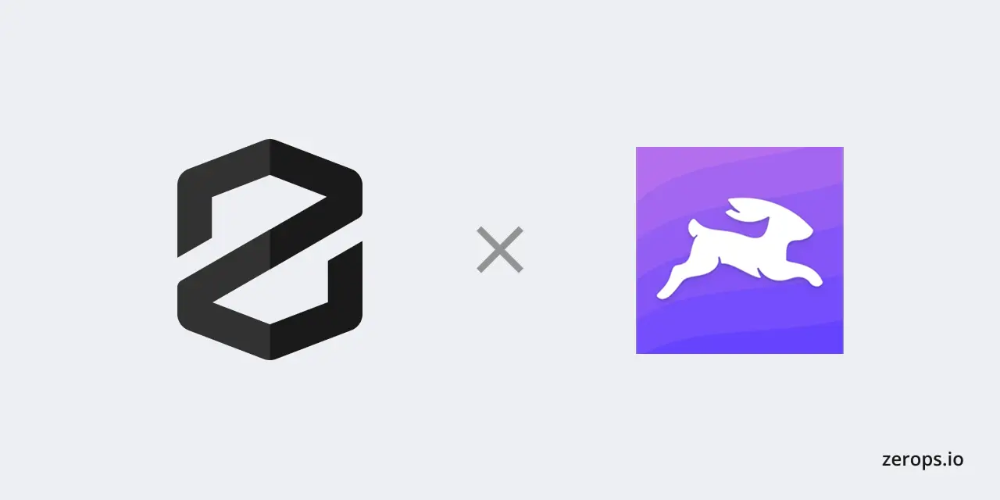

# Zerops × Directus



[Directus](https://directus.io) is an open-source headless CMS and data platform that wraps any SQL database with a powerful REST & GraphQL API, a rich Data Studio UI, and a flexible roles & permissions system. This recipe deploys a fully production-ready Directus instance on [Zerops](https://zerops.io) with zero manual setup.

[](https://app.zerops.io/recipe/directus)

&nbsp;

---

<!-- #ZEROPS_EXTRACT_START:intro# -->

Zerops recipe for [Directus](https://directus.io) — a production-ready headless CMS running on Node.js 22 with PostgreSQL 16, Valkey 7.2 (Redis-compatible) cache, S3-compatible object storage, and Mailpit for email. Ships with a pre-built demo schema (categories, authors, posts) and seeded content so the CMS is fully usable immediately after deploy.

<!-- #ZEROPS_EXTRACT_END:intro# -->

&nbsp;

---

<!-- #ZEROPS_EXTRACT_START:integration-guide# -->

## Architecture

```
Browser / API clients
        ↓
  Directus 11 (Node.js 22)
    ├── PostgreSQL 16   ← primary datastore         (HA in production)
    ├── Valkey 7.2      ← cache + pub/sub sync       (HA in production)
    ├── Object Storage  ← S3-compatible file uploads (persistent)
    └── Mailpit         ← SMTP sink for dev email    (dev only)
```

&nbsp;

## Services

| Service    | Type           | Dev         | Production                 |
| ---------- | -------------- | ----------- | -------------------------- |
| `directus` | Node.js 22     | 1 container | 2–6 containers (autoscale) |
| `db`       | PostgreSQL 16  | NON_HA      | HA (3-node cluster)        |
| `cache`    | Valkey 7.2     | NON_HA      | HA                         |
| `storage`  | Object Storage | 10 GB       | 50 GB                      |
| `mailpit`  | Mailpit        | ✓ included  | ✗ use real SMTP            |

&nbsp;

## Repository layout

```
.
├── data/
│   ├── data.json                       ← seed content (categories, authors, posts, dashboard)
│   ├── images/                         ← post cover images and author avatars
│   └── uploads/                        ← site-wide assets (cover image)
├── database/
│   └── snapshot.yaml                   ← Directus schema snapshot (collections, fields, relations)
├── extensions/
│   └── directus-extension-seed-demo/   ← auto-healing demo content seeder
│       ├── index.js                    ← server.start hook; Knex-direct insert into empty tables
│       └── package.json                ← Directus extension manifest
├── recipes/directus/
│   ├── 0 — Development/import.yaml     ← Development environment (NON_HA services, Mailpit)
│   └── 1 — Production/import.yaml      ← Production environment (HA services, 2–6 containers)
├── docker-compose.yml                  ← local stack with full Zerops parity
├── package.json
└── zerops.yaml                         ← build + run pipeline (`base`, `prod`, `directus`, `dev` setups)
```

> Layout follows the official [`zerops-recipe-apps/strapi-app`](https://github.com/zerops-recipe-apps/strapi-app) convention so the recipe is immediately familiar to anyone who has worked with other Zerops headless-CMS recipes.

&nbsp;

## Deployment flow

A single `zerops.yaml` drives every environment via four setups (`base`, `prod`, `directus`, `dev`). Two `initCommands` run before the HTTP server starts, each wrapped in `zsc execOnce` so multi-container deploys execute exactly once. Demo content is then seeded by a Directus extension hook the first time the server reaches `server.start`:

| Step | Command / hook                                                    | Idempotent via                                               |
| ---- | ----------------------------------------------------------------- | ------------------------------------------------------------ |
| 1    | `directus bootstrap`                                              | `Database already initialized, skipping install`             |
| 2    | `directus schema apply --yes ./database/snapshot.yaml`            | Directus diff engine — only applies the delta                |
| 3    | `directus start` (foreground)                                     | —                                                            |
| 4    | `extensions/directus-extension-seed-demo` fires on `server.start` | `seed_runs` table keyed on `SEED_VERSION` env var            |

```
1. directus bootstrap
   └── Creates all Directus system tables
   └── Creates the first admin user from ADMIN_EMAIL + ADMIN_PASSWORD

2. directus schema apply --yes ./database/snapshot.yaml
   └── Creates collections: categories, authors, posts
   └── Creates all fields, relationships, and display settings
   └── Idempotent — already-existing schema is skipped via Directus diff engine

3. directus start
   └── Launches the HTTP server on port 8055

4. extensions/directus-extension-seed-demo (fires on server.start)
   ├── Skips entirely if SEED_VERSION is not set (production safety guard)
   ├── Skips entirely if this SEED_VERSION is already recorded in seed_runs
   ├── Uploads seed images to object storage via FilesService (idempotent per filename)
   ├── Patches the admin user profile (avatar, title, location, description, tags)
   └── In one transaction:
        ├── For each collection: INSERT rows from data/data.json if table is empty
        ├── Inserts the Insights dashboard and panels into directus_dashboards / directus_panels
        └── Records SEED_VERSION in seed_runs (commit = seed complete)
```

**Why an extension hook instead of a one-shot migration?** The Directus migration system records "done" exactly once in `directus_migrations`, which is correct for schema changes but wrong for a _seed_: if anyone deletes rows in the Data Studio, a migration-based seeder leaves the table empty forever. The hook checks a `seed_runs` table keyed on `SEED_VERSION` — bump the version to re-seed on the next deploy without touching schema migrations.

**SEED_VERSION control:**

| `SEED_VERSION` value | Behaviour |
| -------------------- | --------- |
| Not set (unset)      | Hook skips — safe default for production envs with real data |
| `"1.0.0"` (already in `seed_runs`) | Hook skips — content already seeded |
| `"1.0.1"` (new value) | Hook runs the full seed on next container start |

**Recovery: deleted rows vs deleted collections.**

| What you deleted | How to restore |
| ---------------- | -------------- |
| **Rows** inside a collection | Bump `SEED_VERSION` + `docker compose down -v && docker compose up -d` |
| **A whole collection** | `docker compose down -v && docker compose up -d` — wipes Postgres + Valkey so `bootstrap` + `schema apply` rebuild from scratch. Valkey reset required due to Directus schema-cache bug ([directus#22674](https://github.com/directus/directus/issues/22674)) |

&nbsp;

## Demo content

The seed creates a fully populated CMS on first deploy:

**Categories:** Technology · DevOps · Tutorials

**Authors:** Alex Petrov · Maria Chen (each with avatar, bio, email)

**Posts (3 published, 1 draft):**
| Title | Status | Category |
|-------|--------|----------|
| Getting Started with Directus on Zerops | published | Tutorials |
| Why We Chose Valkey Over Redis | published | Technology |
| Object Storage Deep Dive: S3 on Zerops | published | DevOps |
| High-Availability PostgreSQL on Zerops | draft | DevOps |

**Files (uploaded to object storage):** cover image, 4 post cover images, 3 author avatars — each with title, description, and tags.

**Admin profile:** avatar, title, location, description, and tags patched on the `admin@example.com` user.

**Insights dashboard:** "Content Overview" with 5 metric panels — All Posts, Published, Drafts, Authors, Categories.

&nbsp;

## Secrets & environment variables

These secrets are **randomly generated at import time** and never stored in source code:

| Variable         | Length   | Purpose                                                           |
| ---------------- | -------- | ----------------------------------------------------------------- |
| `SECRET`         | 64 chars | Signs all Directus JWTs and cookies — rotating logs out all users |
| `ADMIN_PASSWORD` | 20 chars | Initial admin account password                                    |
| `ADMIN_TOKEN`    | 40 chars | Static API token for the seed script, CI/CD, and automation       |

All other environment variables are declared in `zerops.yaml` under `envVariables`. Key ones:

| Variable                      | Value     | Why                                               |
| ----------------------------- | --------- | ------------------------------------------------- |
| `ACCEPT_TERMS`                | `"true"`  | Required to acknowledge Directus BSL 1.1 licence  |
| `TELEMETRY`                   | `"false"` | Disables anonymous usage stats                    |
| `SYNCHRONIZATION_STORE`       | `redis`   | Enables Valkey-backed sync across containers      |
| `STORAGE_S3_FORCE_PATH_STYLE` | `"true"`  | Required for custom S3 endpoints (Zerops / MinIO) |

&nbsp;

## After first deploy

1. **Retrieve your admin credentials** — go to Zerops GUI → `directus` service → Environment Variables → Secret Variables → reveal `ADMIN_PASSWORD` and `ADMIN_TOKEN`.

2. **Log in** at your service's subdomain URL with `admin@example.com` and the revealed password.

3. **Set `PUBLIC_URL`** — copy your subdomain URL (e.g. `https://directus-abc123.zerops.app`) and set it as the `PUBLIC_URL` environment variable on the service. This is required for password-reset email links and OAuth redirect URIs.

4. **Change the admin email** — in the Data Studio, go to User Directory → Administrator and update the email to a real address.

&nbsp;

## Multi-container / HA requirements

`SYNCHRONIZATION_STORE=redis` is set unconditionally in `zerops.yaml`. Directus uses it to broadcast across all running containers:

- **Schema cache invalidations** — prevents stale-schema bugs when one container applies a migration
- **Rate-limit counters** — ensures limits aren't bypassed by hitting different containers
- **Auth token blacklists** — ensures logout is respected by all containers immediately

This setting is harmless in single-container dev and essential in multi-container production.

The Production recipe sets `minContainers: 2` to guarantee **zero-downtime rolling upgrades**: Zerops starts new containers and waits for the readiness check (`GET /server/health`) to pass before terminating old ones.

&nbsp;

## Object storage

Directus file uploads are routed to Zerops S3-compatible object storage via these env vars:

```dotenv
STORAGE_LOCATIONS=s3
STORAGE_S3_DRIVER=s3
STORAGE_S3_KEY=${storage_accessKeyId}
STORAGE_S3_SECRET=${storage_secretAccessKey}
STORAGE_S3_BUCKET=${storage_bucketName}
STORAGE_S3_ENDPOINT=${storage_apiUrl}
STORAGE_S3_REGION=us-east-1
STORAGE_S3_FORCE_PATH_STYLE=true
STORAGE_S3_ACL=public-read
```

`FORCE_PATH_STYLE=true` is required because Zerops object storage uses a single endpoint host — the bucket name must be in the URL path (`/bucket/key`) rather than the hostname (`bucket.host`). `public-read` makes uploaded files accessible without signed URLs, which is required for the Directus `/assets` endpoint and Data Studio image previews.

&nbsp;

## Email

**Development** — all outbound email is captured by the **Mailpit** service. Open the Mailpit web UI (port `8025`) via the service subdomain to inspect messages. No real email is ever sent.

**Production** — configure your SMTP provider by adding these env vars in the Zerops GUI:

```
EMAIL_TRANSPORT        smtp
EMAIL_SMTP_HOST        smtp.sendgrid.net
EMAIL_SMTP_PORT        587
DIRECTUS_EMAIL_FROM    no-reply@yourdomain.com
```

Add `EMAIL_SMTP_USER` and `EMAIL_SMTP_PASSWORD` as env **secrets**.

<!-- #ZEROPS_EXTRACT_END:integration-guide# -->

&nbsp;

---

<!-- #ZEROPS_EXTRACT_START:maintenance-guide# -->

## Local development

Mirrors the Zerops production stack exactly using Docker Compose:

```bash
git clone https://github.com/kristiyan-velkov/zerops-directus-cms
cd zerops-directus-cms
cp .env.example .env
docker compose up -d
```

| URL                   | Service                                    |
| --------------------- | ------------------------------------------ |
| http://localhost:8055 | Directus Data Studio                       |
| http://localhost:8025 | Mailpit web UI                             |
| http://localhost:9001 | MinIO Console (minioadmin / minioadmin123) |

Local credentials are in `.env` — see `.env.example` for all options.

**Local service equivalents:**

| Zerops service              | Local Docker image                         |
| --------------------------- | ------------------------------------------ |
| `postgresql@16`             | `postgres:16-alpine`                       |
| `valkey@7.2`                | `valkey/valkey:7.2.13-alpine`              |
| `object-storage`            | `minio/minio:RELEASE.2025-09-07T16-13-09Z` |
| `mailpit-app`               | `axllent/mailpit:v1.29.7`                  |
| `nodejs@22` + `directus@11` | `directus/directus:11.17.4`                |

&nbsp;

## Upgrade Directus

1. Pin both versions in `package.json`:
   ```json
   "directus": "11.x.x",
   "@directus/sdk": "21.x.x"
   ```
2. Update the Docker image tag in `docker-compose.yml`:
   ```yaml
   image: directus/directus:11.x.x
   ```
3. Test locally with `docker compose down -v && docker compose up -d`.
4. Push the change — Zerops triggers a new build and performs a rolling restart.

The `directus bootstrap` initCommand automatically applies any new built-in database migrations during the restart. In the Production environment (`minContainers: 2`) the rolling restart is zero-downtime.

&nbsp;

## Update the schema

If you extend the schema (new collections, fields, relations):

1. Make the changes in your local Directus Data Studio.
2. Export a new snapshot:
   ```bash
   docker compose exec directus node cli.js schema snapshot /directus/database/snapshot.yaml
   ```
3. Commit `database/snapshot.yaml`.
4. Push — on next deploy `schema apply` will diff and apply only the new changes.

&nbsp;

## Retrieve admin credentials

The `ADMIN_PASSWORD` and `ADMIN_TOKEN` are auto-generated at import time:

1. Zerops GUI → your project → `directus` service.
2. **Environment Variables** → **Secret Variables**.
3. Reveal `ADMIN_PASSWORD` and `ADMIN_TOKEN`.

&nbsp;

## Scale the Directus service

**Horizontal** — update `minContainers` / `maxContainers` on the `directus` service in the Zerops GUI, or edit the import YAML and re-import.

**Vertical** — Zerops autoscales RAM and CPU within the bounds set in `verticalAutoscaling` (default: 1–16 GB RAM, 1–10 vCPU in production).

&nbsp;

## Back up the database

Database backups can be configured in the `db` service settings in the Zerops GUI (daily snapshots available on paid plans). To restore a backup, follow the [Zerops database restore guide](https://docs.zerops.io).

<!-- #ZEROPS_EXTRACT_END:maintenance-guide# -->

&nbsp;

---

Need help? Join the [Zerops Discord community](https://discord.gg/zeropsio).

&nbsp;

---

**Author:** [Kristiyan Velkov](https://github.com/kristiyanvelkov)
